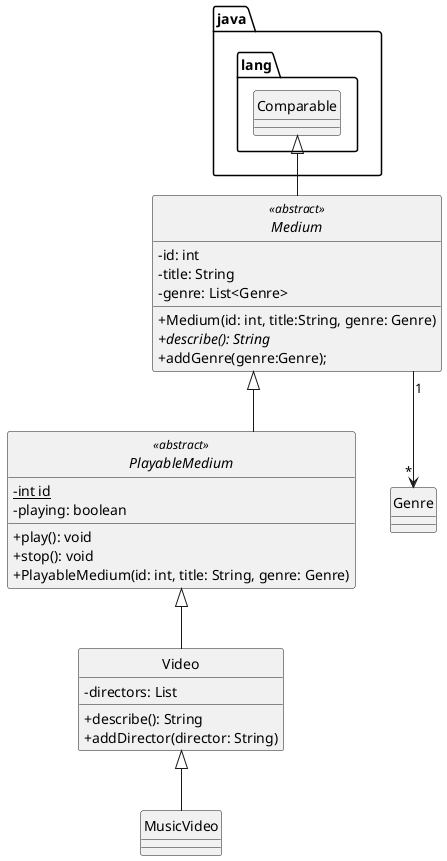

# Kpop programma

Voornaam: Melanie 

Achternaam: Grimminck

Studentnummer: 500858352

### Inleiding

Doel Kpop programma;
1. kpop idols toevoegen en hun info toevoegen aan het programma
2. managers van de groepen toevoegen
3. kpop idols aan een groep toevoegen
4. manager aan een groep toevoegen
5. idols en managers uit groep verwijderen
6. idols kunnen met Performance(); een optreden geven
7. managers managen een groep met Performance();
8. idols en managers kunnen gebruik maken van Workhard();

### UML class diagram

https://lucid.app/lucidchart/b142287e-0925-4bf2-950e-3de9cdde1ec4/edit?invitationId=inv_0a48722b-0712-46d5-951e-0b8f39fc3772

[uml](MelanieGrimminckUML.png)




### Voorwaarden programma

#### OOP1

##### 1. Het commando `git log --pretty=format:"%hx %ad%x09%s" --date=short` bevat inzichtelijke atomaire commits op.

```
Plaats hier het resultaat van git log --pretty=format:"%hx %ad%x09%s" --date=short`
```
Code is werkend en af. Todo: Readme invullen en comments plaatsen. Melanie 36 minutes ago
SonarLint issues aangepakt. Melanie 31/03/2022 18:55
met SonarLint gewerkt aan de code volgens HBO-ICT-conventions op te kunnen leveren. Melanie 31/03/2022 15:09
README.md code snippets toegevoegd. Melanie 31/03/2022 14:51
changed employee Melanie 31/03/2022 14:38
Cast wordt gebruikt. Managercollection aangemaakt. Melanie 31/03/2022 14:37
ALle klasse werkend. Testcode geschreven. Melanie 31/03/2022 12:15
changed employee Melanie 31/03/2022 11:02
Manager class afgemaakt. Instanceoff toegevoegd. Melanie 30/03/2022 14:06
changed employee Melanie 30/03/2022 12:58
Idol class uitgewerkt. To String methode aangemaakt voor idol klasse. Return statements toegevoegd. Melanie 30/03/2022 11:26
Interface uitgewerkt. Melanie 28/03/2022 21:51
Twee subklassen aanwezig. Extra attributen en methoden voor subclasses. Melanie 28/03/2022 18:42
Twee subklassen aanwezig. Extra attributen en methoden voor subclasses. Melanie 28/03/2022 17:29
abstract class met abstract methode gemaakt. Melanie 28/03/2022 14:01
abstract class met abstract methode gemaakt. Melanie 24/03/2022 14:03
In jaar 1 heb ik voor programmeren een restaurant gemaakt in Python. Dit programma ga ik nu omzetten in Java. Interessant om de twee talen met elkaar te kunnen vergelijken. Melanie 21/03/2022 09:21
Merge remote-tracking branch 'origin/main' into main Melanie 15/03/2022 11:44
Merge remote-tracking branch 'origin/main' into main Melanie 15/03/2022 11:43
Merge remote-tracking branch 'origin/main' into main Melanie 15/03/2022 11:43
Merge remote-tracking branch 'origin/main' into main Melanie 15/03/2022 11:43
opstart Melanie 10/02/2022 18:39
java Melanie 10/02/2022 18:39
Update README.md Melanie Egas 10/02/2022 18:35

Bewijs:  [https://gitlab.fdmci.hva.nl/oop-dt/2122/id1s1/melanie-egas-tentamen]

##### 2. Abstract class 'A' correct geïmplementeerd

```java

package model;

public abstract class Employee {
    private String name;
    private int dateOfBirth;
    private int dateStartOfContract;

    protected Employee() {
        name = " ";
        dateOfBirth = 2008;
        dateStartOfContract = 0;
    }

    protected Employee(String name,
                       int dateOfBirth,
                       int dateStartOfContract) {
        this.name = name;
        this.dateOfBirth = dateOfBirth;
        this.dateStartOfContract = dateStartOfContract;
    }

    public String toString(){
        return "Name:\t"+ getName()+"\n"+ "Date of birth:\t"+ getDateOfBirth()+"\n" +"Start contract at:\t"+ getDateStartOfContract();
    }

    public String getName() {

        return name;
    }

    public int getDateOfBirth() {
        return dateOfBirth;
    }


    public int getDateStartOfContract() {
        return dateStartOfContract;
    }


    public abstract String workHard();
}


```

Bewijs:  [linknaarhetbronbestandinjerepo](https://gitlab.fdmci.hva.nl/repo-van-jou)

##### 3. Subclass implementeert abstract class
##### subclass 1 Manager:
```java
package model;

public class Manager extends Employee {
    private int numberGroup;

    public Manager() {
        super();
        numberGroup = 0;
    }


    public Manager(int numberGroup) {
        super();
        this.numberGroup = numberGroup;
    }

    public Manager(String name,
                   int dateOfBirth,
                   int dateStartOfContract) {
        super(name,
                dateOfBirth,
                dateStartOfContract);
        numberGroup = 0;
    }

    public Manager(String name,
                   int dateStartOfContract,
                   int dateOfBirth, int numberGroup) {
        super(name,
                dateOfBirth,
                dateStartOfContract);
        this.numberGroup = numberGroup;
    }


    public String workHard() {
        return "Helping the idol!";
    }

    public String teachNewSong() {
        return "Teaching new song";
    }

    public String teachDancemove() {

        return "teaching dance move";
    }

    public int getNumberGroup() {
        return numberGroup;
    }

    @Override
    public String toString() {

        return super.toString() + "\n"
                + "Number of groups:\t" +
                getNumberGroup();
    }

    public boolean compare(Employee emp) {
        if (emp instanceof Manager) {
            Manager man = (Manager) emp; //castof
            return man.getNumberGroup() > numberGroup;
        }
        return false;
    }
}

```

#### subclass 2 idol:
'''java

package model;

public class Idol extends Employee {

    private boolean isLeader;
    private boolean inGroup;
    private String role;
    private boolean rap;
    private boolean dance;
    private String vocal;

    public Idol() {
        super();
        isLeader = false;
        inGroup = false;
        role = "None";
        dance = false;
        rap = false;
        vocal = "vocal";
    }

    public Idol(boolean isLeader,
                boolean inGroup,
                String role,
                boolean rap,
                String vocal,
                boolean dance) {
        super();
        this.isLeader = isLeader;
        this.inGroup = inGroup;
        this.role = role;
        this.rap = rap;
        this.vocal = vocal;
        this.dance = dance;
    }

    public Idol(String name,
                int dateOfBirth,
                int dateStartOfContract) {
        super(name,
                dateOfBirth,
                dateStartOfContract);
        isLeader = false;
        inGroup = false;
        role = "None";
        dance = false;
        rap = false;
        vocal = "vocal";
    }


    public Idol(String name,
                int dateOfBirth,
                int dateStartOfContract,
                boolean isLeader,
                boolean inGroup,
                String role,
                boolean rap,
                String vocal,
                boolean dance
    ) {
        //zelfde als bij employee
        super(name,
                dateOfBirth,
                dateStartOfContract);
        this.isLeader = isLeader;
        this.inGroup = inGroup;
        this.role = role;
        this.rap = rap;
        this.vocal = vocal;
        this.dance = dance;
    }

    public boolean getLeader() {

        return isLeader;
    }

    public boolean getInGroup() {

        return inGroup;
    }

    public void setInGroup(boolean inGroup) {

        this.inGroup = inGroup;
    }

    public String rap() {
        if (rap) {
            return "ho ho ho!";
        }
        return "sorry I don't rap!";
    }

    public String workHard() {

        return "Practicing very hard!";
    }

    public String sing() {

        return vocal + "!";
    }

    public String dance() {
        if (dance) {
            return "step step step";
        }
        return "Sorry not a dancer!";
    }

    public String getRole() {

        return role;
    }

    public boolean isRap() {

        return rap;
    }

    public boolean isDance() {

        return dance;
    }

    public String getVocal() {

        return vocal;
    }

    @Override
    public String toString() {
        final String positon = "Position: \t" ;
        final String idolInGroup = "Idol in group\n";

        if (dance
                && rap
                && isLeader
                && inGroup) {

            return super.toString() + "\n" +
                    positon +
                    getRole() + "\n" +
                    idolInGroup +
                    "Leader of the group\n" +
                    "Rapper\n" +
                    "Dancer\n" +
                    vocal;
        } else {
            if (dance && inGroup) {
                return super.toString() +
                        "\n" + positon +
                        getRole() +
                        "\n"
                        + idolInGroup
                        + " Dancer";
            }
            if (rap && inGroup) {
                return super.toString() + "\n"
                        + positon + getRole() + "\n"
                        + idolInGroup
                        + "Rapper";
            }
        }
        return super.toString();
    }
}


'''

Bewijs:  [https://gitlab.fdmci.hva.nl/oop-dt/2122/id1s1/melanie-egas-tentamen](https://gitlab.fdmci.hva.nl/repo-van-jou)

##### 4. Interface correct geïmplementeerd. 

Deze interface wordt gebruikt door 2 klasse
1: Group
2: Managercollection

```java
package model;

interface GroupInterface { //empty behaviour
    String performance();
}

```

Bewijs:  [https://gitlab.fdmci.hva.nl/oop-dt/2122/id1s1/melanie-egas-tentamenhttps://gitlab.fdmci.hva.nl/oop-dt/2122/id1s1/melanie-egas-tentamen](https://gitlab.fdmci.hva.nl/repo-van-jou)

##### 5. Er is een klasse aanwezig met minimaal twee constructors 
Klas Employee heeft 2 constructors
Klas Idol heeft 4 constructors
Klas Group heeft 2 constructors
Klas Manager heeft 4 constructors 
 
Als voorbeeld gebruik ik de Group klasse: 
```java
package model;

import java.util.ArrayList;


public class Group implements GroupInterface {
    private ArrayList<Idol> group;
    private Manager manager;
    private String groupName;

    public Group() {
        group = new ArrayList();
        manager = new Manager();
        groupName = "None";

    }

    public Group(Manager manager, String groupName) {
        group = new ArrayList();
        this.manager = manager;
        this.groupName = groupName;
    }

    //de ene constructer roept de andere aan
    public Group(ArrayList<Idol> group,
                 Manager manager,
                 String groupName) {
        this(manager, groupName);
        this.group = group;

    }


    public void joinGroup(Idol idol) {
        group.add(idol);
    }

    public boolean leaveGroup(Idol idol) {
        if (group.isEmpty()) {
            group.remove(idol);
            return true;
        }
        return false;
    }

    @Override
    public String performance() {

        return "We don't need permission to dance!";
    }

    public void Training() {
        for (Idol id : group) {
            System.out.println(id.workHard());
        }
    }

    public String toString() {
        String information = "The manager: \n"
                + manager.toString()
                + "\n" + "Idols:\n";

        for (Idol id : group) {
            information = information + id.toString() +
                    "\n";
        }
        return information;
    }
}
```

Bewijs:  [linknaarhetbronbestandinjerepo](https://gitlab.fdmci.hva.nl/repo-van-jou)

##### 6. `super` key gebruikt voor aanroep constructor

```java
public Idol(String name,
        int dateOfBirth,
        int dateStartOfContract) {
        super(name,
        dateOfBirth,
        dateStartOfContract);
        isLeader = false;
        inGroup = false;
        role = "None";
        dance = false;
        rap = false;
        vocal = "vocal";
        }

```

Bewijs:  [https://gitlab.fdmci.hva.nl/oop-dt/2122/id1s1/melanie-egas-tentamen](https://gitlab.fdmci.hva.nl/repo-van-jou)

##### 7. `super` key gebruikt voor aanroep methode

```java
 @Override
public String toString() {

        return super.toString() + "\n"
        + "Number of groups:\t" +
        getNumberGroup();
        }
        
```

Bewijs:  [https://gitlab.fdmci.hva.nl/oop-dt/2122/id1s1/melanie-egas-tentamenhttps://gitlab.fdmci.hva.nl/oop-dt/2122/id1s1/melanie-egas-tentamen](https://gitlab.fdmci.hva.nl/repo-van-jou)

##### 8. `instanceof` aangetoond

```java

public boolean compare(Employee emp) {
        if (emp instanceof Manager) {
        Manager man = (Manager) emp; //castof
        return man.getNumberGroup() > numberGroup;
        }
        return false;
        }
```

Bewijs:  [https://gitlab.fdmci.hva.nl/oop-dt/2122/id1s1/melanie-egas-tentamen](https://gitlab.fdmci.hva.nl/repo-van-jou)

##### 9. cast gebruikt voor gebruik van classe-specifieke methodes

```java

public boolean compare(Employee emp) {
        if (emp instanceof Manager) {
        Manager man = (Manager) emp; //castof
        return man.getNumberGroup() > numberGroup;
        }
        return false;
        }
```

Bewijs:  [https://gitlab.fdmci.hva.nl/oop-dt/2122/id1s1/melanie-egas-tentamen](https://gitlab.fdmci.hva.nl/repo-van-jou)

##### 10. Er is testcode aanwezig om de punten hierboven te demonstreren. (Als je ook OOP2 doet: gebruik testcode-voorwaarden van OOP2)

```java
package maincode;

import model.Group;
import model.Idol;
import model.Manager;
import model.Managercollection;


/*
 Melanie Grimminck
 Doel Kpop programma;
 1. kpop idols toevoegen en hun info toevoegen aan het programma
 2. managers van de groepen toevoegen
 3. kpop idols aan een groep toevoegen
 4. manager aan een groep toevoegen
 5. idols en managers uit groep verwijderen
 6. idols kunnen met Performance(); een optreden geven
 7. managers managen een groep met Performance();
 8. idols en managers kunnen gebruik maken van Workhard();
*/

public class Main {
    public static void main(String[] args) {


        Manager manager = new Manager("Fernando",
                2008,
                1990,
                5);
        Idol jungkook = new Idol("Jungkook",
                1993,
                2015,
                false,
                true,
                "front",
                true,
                "lalala",
                false
        );
        Idol namjoon = new Idol("Namjoon",
                1993,
                2015,
                true,
                true,
                "front",
                true,
                "lalala",
                false
        );

        Idol hoseok = new Idol("Hoseok",
                1992,
                2015,
                false,
                true,
                "left side",
                true,
                "rapraprap",
                true
        );

        Idol jinseok = new Idol("Jinseok",
                1991,
                2015,
                false,
                true,
                "right side",
                false,
                "ladieladieda",
                false
        );

        Group g = new Group(manager, "EXO");
        System.out.println(jungkook.dance());
        g.joinGroup(jungkook);
        System.out.println(namjoon.rap());
        g.joinGroup(namjoon);
        System.out.println(hoseok.dance());
        System.out.println(hoseok.sing());
        g.joinGroup(hoseok);
        System.out.println(jinseok.sing());
        g.joinGroup(jinseok);
        System.out.print(g);
        System.out.println(g.performance());
        if (g.leaveGroup(jungkook)) {
            System.out.println(jungkook.getName() + " removed!");
        }
        System.out.println(g);
        System.out.println(g.performance());
        System.out.println(jungkook.workHard());
        System.out.println(manager.workHard());
        System.out.println(manager.teachDancemove());


        System.out.println("List of Managers");
        Manager m1 = new Manager("Carlos",
                2010,
                1991,
                4);
        Manager m2 = new Manager("Camillia",
                2011,
                1989,
                10);
        Manager m3 = new Manager("Felipe",
                2007,
                1990,
                3);
        Managercollection collect = new Managercollection();
        collect.addManager(m1);
        collect.addManager(m2);
        collect.addManager(m3);
        System.out.println(collect);
        System.out.println(m3.teachNewSong());
        if (m1.compare(m2)) {
            System.out.println(m2.getName()
                    + " is better than "
                    + m1.getName());
        } else {
            System.out.println(m1.getName()
                    + " is better than "
                    + m2.getName());
        }
        

    }
}

```

Bewijs:  [https://gitlab.fdmci.hva.nl/oop-dt/2122/id1s1/melanie-egas-tentamen]

##### 11. Classes en methodes zijn voldoen aan HBO-ICT coding standards

```java

@Override //redefine de String van employee
    public String toString() {
        final String positon = "Position: \t" ;
        final String idolInGroup = "Idol in group\n";

        if (dance  //als de Idol een rapper, leader en in een groep is
                //wordt de bijpassende toString methode uitgevoerd
                // hier zijn verschillende opties voor
                && rap
                && isLeader
                && inGroup) {

            return super.toString() + "\n" +
                    positon +
                    getRole() + "\n" +
                    idolInGroup +
                    "Leader of the group\n" +
                    "Rapper\n" +
                    "Dancer\n" +
                    vocal;
        } else {
            if (dance && inGroup) {
                return super.toString() +
                        "\n" + positon +
                        getRole() +
                        "\n"
                        + idolInGroup
                        + " Dancer";
            }
            if (rap && inGroup) {
                return super.toString() + "\n"
                        + positon + getRole() + "\n"
                        + idolInGroup
                        + "Rapper";
            }
        }
        return super.toString();
    }

```

Bewijs:  [https://gitlab.fdmci.hva.nl/oop-dt/2122/id1s1/melanie-egas-tentamen](https://gitlab.fdmci.hva.nl/repo-van-jou)

#### OOP2

Naast de OOP1 voorwaarden dient je OOP2 programma aan de volgende voorwaarden te voldoen:

##### 1. Gebruikt en implementeert minimaal 2 functionele interfaces uit de package `java.util.function`
```java
Plaats hier je code snippets
```

Bewijs:  [linknaarhetbronbestandinjerepo](https://gitlab.fdmci.hva.nl/repo-van-jou)

##### 2. Een classe met 2 endpoints (d.m.v. Javalin framework)

   1. GET request waarbij er data uit een tekstbestand wordt gelezen en terug gestuurd.
   2. POST request waarbij er data wordt weggeschreven naar een tekstbestand.
```java
Plaats hier je code snippets voor GET request
```

Bewijs:  [linknaarhetbronbestandinjerepo](https://gitlab.fdmci.hva.nl/repo-van-jou)

```java
Plaats hier je code snippets voor POST request
```

Bewijs:  [linknaarhetbronbestandinjerepo]

##### 3. Een custom Exception "E" gedefiniëerd.

```
Plaats hier je code snippets
```

Bewijs:  [linknaarhetbronbestandinjerepo](https://gitlab.fdmci.hva.nl/repo-van-jou)

##### 4. Custom Exception "E" wordt gebruikt via een `throws` constructie.

```
Plaats hier je code snippets
```

Bewijs:  [linknaarhetbronbestandinjerepo](https://gitlab.fdmci.hva.nl/repo-van-jou)

##### 5. Custom Exception "E" wordt gebruikt via een `catch` constructie

```
Plaats hier je code snippets
```

Bewijs:  [linknaarhetbronbestandinjerepo](https://gitlab.fdmci.hva.nl/repo-van-jou)

##### 6. Minimaal 1 `intermediate operation` op een stream

```
Plaats hier je code snippets
```

Bewijs:  [linknaarhetbronbestandinjerepo](https://gitlab.fdmci.hva.nl/repo-van-jou)

##### 7. Minimaal 1 `terminal operation` op een stream

```
Plaats hier je code snippets
```

Bewijs:  [linknaarhetbronbestandinjerepo](https://gitlab.fdmci.hva.nl/repo-van-jou)

##### 8. Testcode met 100% code coverage

```
Plaats hier je code snippets
```

Bewijs:  [linknaarhetbronbestandinjerepo](https://gitlab.fdmci.hva.nl/repo-van-jou)

