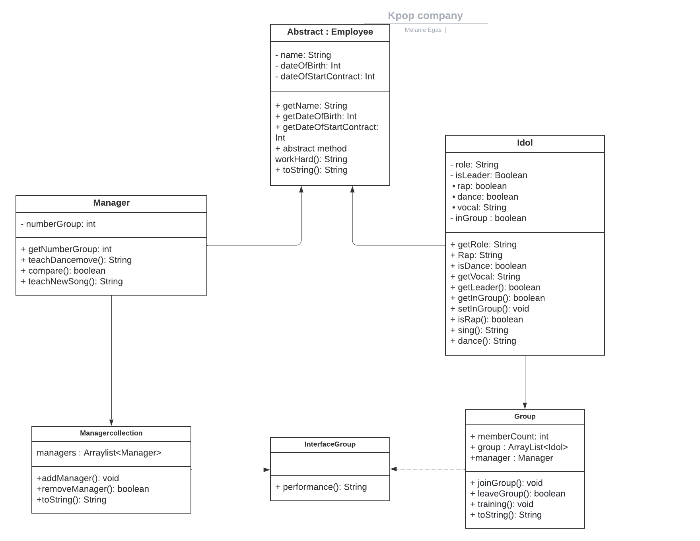
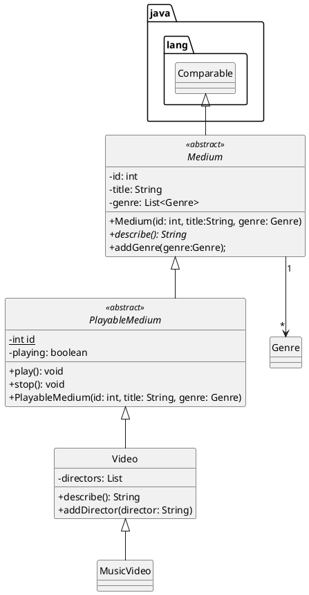

# Kpop programma

Voornaam: Melanie

Achternaam: Grimminck

Studentnummer: 500858352

### Inleiding

Doel Kpop programma;

1. kpop idols toevoegen en hun info toevoegen aan het programma
2. managers van de groepen toevoegen
3. kpop idols aan een groep toevoegen
4. manager aan een groep toevoegen
5. idols en managers uit groep verwijderen
6. idols kunnen met Performance(); een optreden geven
7. managers managen een groep met Performance();
8. idols en managers kunnen gebruik maken van Workhard();
9. gebruiker kan salaris van een groep verhogen
10. een lijst met idols en hun info met Javalin GET

### UML class diagram

https://lucid.app/lucidchart/b142287e-0925-4bf2-950e-3de9cdde1ec4/edit?invitationId=inv_0a48722b-0712-46d5-951e-0b8f39fc3772





### Voorwaarden programma

#### OOP1

##### 1. Het commando `git log --pretty=format:"%hx %ad%x09%s" --date=short` bevat inzichtelijke atomaire commits op.

```
6082024x 2022-06-29     Code nagelopen met SonarLint aangepast waar nodig en mogelijk
1d30a0ex 2022-06-29     Extra stream, tests en Javalin toegevoegd
48d156cx 2022-06-29     Stream en stream test afgemaakt
20d8835x 2022-06-28     Links naar bewijs OOP1 toegevoegd
8bd150fx 2022-06-28     1e util function nuttig en correct geimplementeerd en een custom exception gedefineeerd
3557f06x 2022-06-28     Javalin is werkzaam Classes opgeruimd
d6a1e98x 2022-06-24     javalin
132af2bx 2022-06-08     2 functionele interfaces
c52591cx 2022-06-08     Updated employee class.
8691d28x 2022-06-08     2 functionele interfaces
e877b18x 2022-04-07     Update README.md

```

Bewijs:  [https://gitlab.fdmci.hva.nl/oop-dt/2122/id1s1/melanie-egas-tentamen/-/commits/main]

##### 2. Abstract class 'A' correct geïmplementeerd

```java

package model;

public abstract class Employee {
   private final String name;
   private final int dateOfBirth;
   private final int dateStartOfContract;

   protected Employee() {
      name = " ";
      dateOfBirth = 2008;
      dateStartOfContract = 0;
   }

   protected Employee(String name,
                      int dateOfBirth,
                      int dateStartOfContract) {
      this.name = name;
      this.dateOfBirth = dateOfBirth;
      this.dateStartOfContract = dateStartOfContract;
   }

   public String toString() {
      return "Name:\t" + getName() + "\n" + "Date of birth:\t" + getDateOfBirth() + "\n" + "Start contract at:\t" + getDateStartOfContract();
   }

   public String getName() {

      return name;
   }

   public int getDateOfBirth() {
      return dateOfBirth;
   }


   public int getDateStartOfContract() {
        return dateStartOfContract;
    }


    public abstract String workHard();
}


```

Bewijs:  [https://gitlab.fdmci.hva.nl/oop-dt/2122/id1s1/melanie-egas-tentamen/-/blob/main/target/classes/model/Manager.class](https://gitlab.fdmci.hva.nl/repo-van-jou)

##### 3. Subclass implementeert abstract class

##### subclass 1 Manager:

```java
package model;

public class Manager extends Employee {
   private final int numberGroup;

   public Manager() {
      super();
      numberGroup = 0;
   }


   public Manager(int numberGroup) {
      super();
      this.numberGroup = numberGroup;
   }

   public Manager(String name,
                   int dateOfBirth,
                   int dateStartOfContract) {
        super(name,
                dateOfBirth,
                dateStartOfContract);
        numberGroup = 0;
    }

    public Manager(String name,
                   int dateStartOfContract,
                   int dateOfBirth, int numberGroup) {
        super(name,
                dateOfBirth,
                dateStartOfContract);
        this.numberGroup = numberGroup;
    }


    public String workHard() {
        return "Helping the idol!";
    }

    public String teachNewSong() {
        return "Teaching new song";
    }

    public String teachDancemove() {

        return "teaching dance move";
    }

    public int getNumberGroup() {
        return numberGroup;
    }

    @Override
    public String toString() {

        return super.toString() + "\n"
                + "Number of groups:\t" +
                getNumberGroup();
    }

    public boolean compare(Employee emp) {
        if (emp instanceof Manager) {
            Manager man = (Manager) emp; //castof
            return man.getNumberGroup() > numberGroup;
        }
        return false;
    }
}

```

#### subclass 2 idol:

```java

package model;


public class Idol extends Employee {
   private final boolean isLeader;
   private boolean inGroup;
   private final String role;
   private final boolean rap;
   private final boolean dance;
   private final String vocal;

   public Idol() {
      super();
      isLeader = false;
      inGroup = false;
      role = "None";
      dance = false;
      rap = false;
      vocal = "vocal";
   }``

   public Idol(boolean isLeader,
               boolean inGroup,
               String role,
               boolean rap,
               String vocal,
               boolean dance) {
      super();
      this.isLeader = isLeader;
      this.inGroup = inGroup;
      this.role = role;
      this.rap = rap;
      this.vocal = vocal;
      this.dance = dance;
   }

   public Idol(String name,
               int dateOfBirth,
               int dateStartOfContract) {
      super(name,
                dateOfBirth,
                dateStartOfContract);
        isLeader = false;
        inGroup = false;
        role = "None";
        dance = false;
        rap = false;
        vocal = "vocal";
    }


    public Idol(String name,
                int dateOfBirth,
                int dateStartOfContract,
                boolean isLeader,
                boolean inGroup,
                String role,
                boolean rap,
                String vocal,
                boolean dance
    ) {
        //zelfde als bij employee
        super(name,
                dateOfBirth,
                dateStartOfContract);
        this.isLeader = isLeader;
        this.inGroup = inGroup;
        this.role = role;
        this.rap = rap;
        this.vocal = vocal;
        this.dance = dance;
    }

    public boolean getLeader() {

        return isLeader;
    }

    public boolean getInGroup() {

        return inGroup;
    }

    public void setInGroup(boolean inGroup) {

        this.inGroup = inGroup;
    }

    public String rap() {
        if (rap) {
            return "ho ho ho!";
        }
        return "sorry I don't rap!";
    }

    public String workHard() {

        return "Practicing very hard!";
    }

    public String sing() {

        return vocal + "!";
    }

    public String dance() {
        if (dance) {
            return "step step step";
        }
        return "Sorry not a dancer!";
    }

    public String getRole() {

        return role;
    }

    public boolean isRap() {

        return rap;
    }

    public boolean isDance() {

        return dance;
    }

    public String getVocal() {

        return vocal;
    }

    @Override
    public String toString() {
       final String positon = "Position: \t";
       final String idolInGroup = "Idol in group\n";

        if (dance
                && rap
                && isLeader
                && inGroup) {

            return super.toString() + "\n" +
                    positon +
                    getRole() + "\n" +
                    idolInGroup +
                    "Leader of the group\n" +
                    "Rapper\n" +
                    "Dancer\n" +
                    vocal;
        } else {
            if (dance && inGroup) {
                return super.toString() +
                        "\n" + positon +
                        getRole() +
                        "\n"
                        + idolInGroup
                        + " Dancer";
            }
            if (rap && inGroup) {
                return super.toString() + "\n"
                        + positon + getRole() + "\n"
                        + idolInGroup
                        + "Rapper";
            }
        }
        return super.toString();
    }
}


```

Bewijs:  [https://gitlab.fdmci.hva.nl/oop-dt/2122/id1s1/melanie-egas-tentamen/-/blob/main/target/classes/model/Idol.class](https://gitlab.fdmci.hva.nl/repo-van-jou)

##### 4. Interface correct geïmplementeerd.

Deze interface wordt gebruikt door 2 klasse 1: Group 2: Managercollection

```java
package model;

interface GroupInterface { //empty behaviour
   String performance();
}

```

Bewijs:  [https://gitlab.fdmci.hva.nl/oop-dt/2122/id1s1/melanie-egas-tentamen/-/blob/main/target/classes/model/GroupInterface.class](https://gitlab.fdmci.hva.nl/repo-van-jou)

##### 5. Er is een klasse aanwezig met minimaal twee constructors

Klas Employee heeft 2 constructors Klas Idol heeft 4 constructors Klas Group heeft 2 constructors Klas Manager heeft 4
constructors

Als voorbeeld gebruik ik de Group klasse:

```java
package model;

import java.util.ArrayList;


public class Group implements GroupInterface {
   private ArrayList<Idol> group;
   private final Manager manager;
   private final String groupName;

   public Group() {
      group = new ArrayList();
      manager = new Manager();
      groupName = "None";

   }

   public Group(Manager manager, String groupName) {
      group = new ArrayList();
      this.manager = manager;
      this.groupName = groupName;
   }

   //de ene constructer roept de andere aan
   public Group(ArrayList<Idol> group,
                Manager manager,
                String groupName) {
      this(manager, groupName);
      this.group = group;

   }


   public void joinGroup(Idol idol) {
      group.add(idol);
   }

   public boolean leaveGroup(Idol idol) {
      if (group.isEmpty()) {
            group.remove(idol);
            return true;
        }
        return false;
    }

    @Override
    public String performance() {

        return "We don't need permission to dance!";
    }

    public void Training() {
        for (Idol id : group) {
            System.out.println(id.workHard());
        }
    }

    public String toString() {
        String information = "The manager: \n"
                + manager.toString()
                + "\n" + "Idols:\n";

        for (Idol id : group) {
            information = information + id.toString() +
                    "\n";
        }
        return information;
    }
}
```

Bewijs:  [https://gitlab.fdmci.hva.nl/oop-dt/2122/id1s1/melanie-egas-tentamen/-/blob/main/src/main/java/model/Group.java](https://gitlab.fdmci.hva.nl/repo-van-jou)

##### 6. `super` key gebruikt voor aanroep constructor

```java
public Idol(){
        super();
        isLeader=false;
        inGroup=false;
        role="None";
        dance=false;
        rap=false;
        vocal="vocal";
        this.salaryIncrease=(increase)->this.salary*increase;
        this.salary=100;
        }


```

Bewijs:  [https://gitlab.fdmci.hva.nl/oop-dt/2122/id1s1/melanie-egas-tentamen/-/blob/main/src/main/java/model/Idol.java](https://gitlab.fdmci.hva.nl/repo-van-jou)

##### 7. `super` key gebruikt voor aanroep methode

```java
 @Override
public String toString(){

        return super.toString()+"\n"
        +"Number of groups:\t"+
        getNumberGroup();
        }

```

Bewijs:  [https://gitlab.fdmci.hva.nl/oop-dt/2122/id1s1/melanie-egas-tentamen/-/blob/main/src/main/java/model/Group.java](https://gitlab.fdmci.hva.nl/repo-van-jou)

##### 8. `instanceof` aangetoond

```java

public boolean compare(Employee emp){
        if(emp instanceof Manager){
        Manager man=(Manager)emp; //castof
        return man.getNumberGroup()>numberGroup;
        }
        return false;
        }
```

Bewijs:  [https://gitlab.fdmci.hva.nl/oop-dt/2122/id1s1/melanie-egas-tentamen/-/blob/main/src/main/java/model/Manager.java](https://gitlab.fdmci.hva.nl/repo-van-jou)

##### 9. cast gebruikt voor gebruik van classe-specifieke methodes

```java

public boolean compare(Employee emp){
        if(emp instanceof Manager){
        Manager man=(Manager)emp; //castof
        return man.getNumberGroup()>numberGroup;
        }
        return false;
        }
```

Bewijs:  [https://gitlab.fdmci.hva.nl/oop-dt/2122/id1s1/melanie-egas-tentamen/-/blob/main/src/main/java/model/Manager.java](https://gitlab.fdmci.hva.nl/repo-van-jou)

##### 10. Er is testcode aanwezig om de punten hierboven te demonstreren. (Als je ook OOP2 doet: gebruik testcode-voorwaarden van OOP2)

Testcode OOP2 zie bij OOP2

```java
package maincode;

import model.Group;
import model.Idol;
import model.Manager;
import model.Managercollection;


/*
 Melanie Grimminck
 Doel Kpop programma;
 1. kpop idols toevoegen en hun info toevoegen aan het programma
 2. managers van de groepen toevoegen
 3. kpop idols aan een groep toevoegen
 4. manager aan een groep toevoegen
 5. idols en managers uit groep verwijderen
 6. idols kunnen met Performance(); een optreden geven
 7. managers managen een groep met Performance();
 8. idols en managers kunnen gebruik maken van Workhard();
*/

public class maincode.Main{
public static void main(String[]args){


        Manager manager=new Manager("Fernando",
        2008,
        1990,
        5);
        Idol jungkook=new Idol("Jungkook",
        1993,
        2015,
        false,
        true,
        "front",
        true,
        "lalala",
        false
        );
        Idol namjoon=new Idol("Namjoon",
        1993,
        2015,
        true,
        true,
        "front",
        true,
        "lalala",
        false
        );

        Idol hoseok=new Idol("Hoseok",
        1992,
        2015,
        false,
        true,
        "left side",
        true,
        "rapraprap",
        true
        );

        Idol jinseok=new Idol("Jinseok",
        1991,
        2015,
        false,
        true,
        "right side",
        false,
        "ladieladieda",
        false
        );

        Group g=new Group(manager,"EXO");
        System.out.println(jungkook.dance());
        g.joinGroup(jungkook);
        System.out.println(namjoon.rap());
        g.joinGroup(namjoon);
        System.out.println(hoseok.dance());
        System.out.println(hoseok.sing());
        g.joinGroup(hoseok);
        System.out.println(jinseok.sing());
        g.joinGroup(jinseok);
        System.out.print(g);
        System.out.println(g.performance());
        if(g.leaveGroup(jungkook)){
        System.out.println(jungkook.getName()+" removed!");
        }
        System.out.println(g);
        System.out.println(g.performance());
        System.out.println(jungkook.workHard());
        System.out.println(manager.workHard());
        System.out.println(manager.teachDancemove());


        System.out.println("List of Managers");
        Manager m1=new Manager("Carlos",
        2010,
        1991,
        4);
        Manager m2=new Manager("Camillia",
        2011,
        1989,
        10);
        Manager m3=new Manager("Felipe",
        2007,
        1990,
        3);
        Managercollection collect=new Managercollection();
        collect.addManager(m1);
        collect.addManager(m2);
        collect.addManager(m3);
        System.out.println(collect);
        System.out.println(m3.teachNewSong());
        if(m1.compare(m2)){
        System.out.println(m2.getName()
        +" is better than "
        +m1.getName());
        }else{
        System.out.println(m1.getName()
        +" is better than "
        +m2.getName());
        }


        }
        }

```

Bewijs:  [https://gitlab.fdmci.hva.nl/oop-dt/2122/id1s1/melanie-egas-tentamen/-/blob/main/src/main/java/Main.java][https://gitlab.fdmci.hva.nl/oop-dt/2122/id1s1/melanie-egas-tentamen]

##### 11. Classes en methodes zijn voldoen aan HBO-ICT coding standards

```java

@Override //redefine de String van employee
public String toString(){
final String positon="Position: \t";
final String idolInGroup="Idol in group\n";

        if(dance  //als de Idol een rapper, leader en in een groep is
        //wordt de bijpassende toString methode uitgevoerd
        // hier zijn verschillende opties voor
        &&rap
        &&isLeader
        &&inGroup){

        return super.toString()+"\n"+
        positon+
        getRole()+"\n"+
        idolInGroup+
        "Leader of the group\n"+
        "Rapper\n"+
        "Dancer\n"+
        vocal;
        }else{
        if(dance&&inGroup){
        return super.toString()+
        "\n"+positon+
        getRole()+
        "\n"
        +idolInGroup
        +" Dancer";
        }
        if(rap&&inGroup){
        return super.toString()+"\n"
        +positon+getRole()+"\n"
        +idolInGroup
        +"Rapper";
        }
        }
        return super.toString();
        }

```

Bewijs:  [https://gitlab.fdmci.hva.nl/oop-dt/2122/id1s1/melanie-egas-tentamen](https://gitlab.fdmci.hva.nl/repo-van-jou)

#### OOP2

Naast de OOP1 voorwaarden dient je OOP2 programma aan de volgende voorwaarden te voldoen:

##### 1. Gebruikt en implementeert minimaal 2 functionele interfaces uit de package `java.util.function`

1. Het liedje is gemaakt met Koreaanse tekens, zo zou het er uit moeten zien:
   
   Zonder Koreaans pakket krijgt u vraagtekens.

```java
//de lijst met woorden voor het liedje, deze lijst wordt door de manager random gebruikt om een liedje
// samen te stellen. In het Koreaans maakt de woordvolgorde in een zin niet uit.
public void createSong(int l){
        List<String> s=Arrays.asList(
        "가자"," 내","피"," 땀","눈물도몸","마음","영혼도",
        "회망","머리","머리","처음","처음","하루","몰라",
        "가자","내","피","땀","눈물도몸","마음","회망",
        "영혼도","몰라","하루");
        Random rand=new Random();


// This util.function returns a random value for the creation of a song

        var randomValue=(Supplier<Integer>)()->rand.nextInt((s.size()+1));
        for(int i=0;i<l; i++){
        newSong.add(s.get(randomValue.get()));
        }
        }

public List<String> getSong(){
        return newSong;
        }

public String showSong(){
        String show="";
        for(int i=0;i<newSong.size();i++){
        show=show+newSong.get(i)+" ";
        }
        return show;
        }
```

Bewijs:  [https://gitlab.fdmci.hva.nl/oop-dt/2122/id1s1/melanie-egas-tentamen/-/blob/main/src/main/java/model/Manager.java

2. SalaryCalculator, gebruiker kan het salaris verhogen via terminal. Gebruik gemaakt van util double

```java

public void salaryCalculator(double increase)throws InvalidSalaryIncreaseException{
        if(increase< 0)
        throw new InvalidSalaryIncreaseException();
        this.salary=salaryIncrease.apply(increase);
        }

public double getSalary(){
        return this.salary;
        }


//tells how to compare the idols in the stream
public int compareTo(Object o){
        Idol idol=(Idol)o;
        return Integer.compare(idol.getDateOfBirth(),this.getDateOfBirth());
        }

private Double apply(Double increase){
        return this.salary*increase;
        }

private Double apply2(Double increase){
        return this.salary*increase;
        }
        }
```

[https://gitlab.fdmci.hva.nl/oop-dt/2122/id1s1/melanie-egas-tentamen/-/blob/main/src/main/java/model/Idol.java]](https://gitlab.fdmci.hva.nl/repo-van-jou)


##### 2. Een classe met 2 endpoints (d.m.v. Javalin framework)

1. GET request waarbij er data uit een tekstbestand wordt gelezen en terug gestuurd.


2. POST request waarbij er data wordt weggeschreven naar een tekstbestand.

GET


```java

/**
 * Return file content on GET
 * @param ctx Javalin context app
 * @throws FileNotFoundException when file is not found
 */
public static void getFile(Context ctx)throws FileNotFoundException{
        FileInputStream fileInputStream=new FileInputStream("src/main/java/idolFile.txt");
        InputStreamReader inputStreamReader=new InputStreamReader(fileInputStream,StandardCharsets.UTF_8);
        try(BufferedReader reader=new BufferedReader(inputStreamReader)){
        ctx.result(reader.lines().collect(Collectors.joining()));
        }catch(FileNotFoundException e){
        throw e;
        }catch(IOException e){
        e.printStackTrace();
        }
        }

```

Bewijs:  [https://gitlab.fdmci.hva.nl/oop-dt/2122/id1s1/melanie-egas-tentamen/-/blob/main/src/main/java/MainJavalin.java](https://gitlab.fdmci.hva.nl/repo-van-jou)

POST


```java
 /**
 * Write POST body to text file
 *
 * @param ctx Javalin context
 * @throws IOException if not able to write
 */
public static void postFile(Context ctx)throws IOException{
        FileOutputStream fileOutputStream=new FileOutputStream("src/main/java/idolPostFile.txt");
        try(OutputStreamWriter outputStreamWriter=new OutputStreamWriter(fileOutputStream,StandardCharsets.UTF_8)){
        try(BufferedWriter writer=new BufferedWriter(outputStreamWriter)){
        writer.write(ctx.body());
        writer.flush();
        }
        }

        }
```

Bewijs:  [https://gitlab.fdmci.hva.nl/oop-dt/2122/id1s1/melanie-egas-tentamen/-/blob/main/src/main/java/MainJavalin.java](https://gitlab.fdmci.hva.nl/repo-van-jou)


##### 3. Een custom Exception "E" gedefiniëerd.

```java
      try(Scanner sc=new Scanner(in)){
        out.println("Increase the salary of an idolgroup. Please enter a number to multipy the 2021 salary with:  ");
        double profit=sc.nextDouble();
        out.println("2021 Salary");
        out.println(g.getGroupMembers().get(0).getSalary());  //get the salary of the first member (they all have the same salary)

        out.println("2022 Salary");
        try{
        for(Idol idol:g.getGroupMembers()){
        idol.salaryCalculator(profit);
        }

        out.println(g.getGroupMembers().get(0).getSalary());

        }catch(InvalidSalaryIncreaseException e){

        out.println(e.getMessage());

        }
        }
        ```

        Bewijs:[https://gitlab.fdmci.hva.nl/oop-dt/2122/id1s1/melanie-egas-tentamen/-/blob/main/src/main/java/model/Idol.java](https://gitlab.fdmci.hva.nl/repo-van-jou)

        ##### 4.Custom Exception"E"wordt gebruikt via een `throws` constructie.

        ```java

public void salaryCalculator(double increase)throws InvalidSalaryIncreaseException{
        if(increase< 0)
        throw new InvalidSalaryIncreaseException();
        this.salary = salaryIncrease.apply(increase);
    }

    public double getSalary() {
        return this.salary;
    }

```

Bewijs:  [https://gitlab.fdmci.hva.nl/oop-dt/2122/id1s1/melanie-egas-tentamen/-/blob/main/src/main/java/model/Idol.java](https://gitlab.fdmci.hva.nl/repo-van-jou)

##### 5. Custom Exception "E" wordt gebruikt via een `catch` constructie

```
     try (Scanner sc = new Scanner(in)) {
            out.println("Increase the salary of an idolgroup. Please enter a number to multipy the 2021 salary with:  ");
            double profit = sc.nextDouble();
            out.println("2021 Salary");
            out.println(g.getGroupMembers().get(0).getSalary());  //get the salary of the first member (they all have the same salary)

            out.println("2022 Salary");
            try {
                for (Idol idol : g.getGroupMembers()) {
                    idol.salaryCalculator(profit);
                }

                out.println(g.getGroupMembers().get(0).getSalary());

            } catch (InvalidSalaryIncreaseException e) {
                //trycatch
                out.println(e.getMessage());

            }
        }
```

Bewijs:  [https://gitlab.fdmci.hva.nl/oop-dt/2122/id1s1/melanie-egas-tentamen/-/blob/main/src/main/java/Main.java](https://gitlab.fdmci.hva.nl/repo-van-jou)

##### 6. Minimaal 1 `intermediate operation` op een stream

eerste intermediate operation

```

    //Maknae is the youngest one of the group who isn't a dancer. filter is an intermediate
    // stream that checks who's the maknae of a group
    public Idol maknae() {
        return groupList.stream()
                .filter(x -> x.isDance() == false) // .filter is intermediate
                .min((a, b) -> a.compareTo(b))
                .get();  //.min is terminal stream
    }

```

Bewijs:  [https://gitlab.fdmci.hva.nl/oop-dt/2122/id1s1/melanie-egas-tentamen/-/blob/main/src/main/java/model/Group.java](https://gitlab.fdmci.hva.nl/repo-van-jou)

tweede intermediate stream

```
   @Test
    void leaveGroupTest(){
        group.leaveGroup("Lisa");
        List<Idol> result = group.getGroupMembers().stream()
                                                        .filter(e -> e.getName().compareTo("Lisa") == 0)
                                                        .toList();
        
        assertTrue(result.isEmpty());
    }
```

Bewijs:  [https://gitlab.fdmci.hva.nl/oop-dt/2122/id1s1/melanie-egas-tentamen/-/blob/main/src/test/java/GroupTest.java](https://gitlab.fdmci.hva.nl/repo-van-jou)

##### 7. Minimaal 1 `terminal operation` op een stream

```

    //Maknae is the youngest one of the group who isn't a dancer. filter is an intermediate
    // stream that checks who's the maknae of a group
    public Idol maknae() {
        return groupList.stream()
                .filter(x -> x.isDance() == false) // .filter is intermediate
                .min((a, b) -> a.compareTo(b))
                .get();  //.min is terminal stream
    }
```

Bewijs:  [https://gitlab.fdmci.hva.nl/oop-dt/2122/id1s1/melanie-egas-tentamen/-/blob/main/src/main/java/model/Group.java](https://gitlab.fdmci.hva.nl/repo-van-jou)

##### 8. Testcode met 100% code coverage


GroupTest

```
import model.Group;
import model.Idol;
import model.Manager;
import org.junit.jupiter.api.Test;

import java.util.List;

import static org.junit.jupiter.api.Assertions.assertEquals;
import static org.junit.jupiter.api.Assertions.assertTrue;

class GroupTest {
    Group group;
    Idol Rose, Lisa, Jennie, Jisoo;

    public GroupTest() {
        Manager manager = new Manager("Yi Hyeo-rae",
                2021,
                1980,
                2);

        Lisa = new Idol("Lisa",
                1990,
                2015,
                true,
                true,
                "front",
                true,
                "lalala",
                false);

        Rose = new Idol("Rose",
                1996,
                2015,
                false,
                true,
                "left",
                false,
                "lalala",
                false);

        Jennie = new Idol("Jennie",
                1990,
                2015,
                false,
                true,
                "left",
                false,
                "lalala",
                false);

        Jisoo = new Idol("Jisoo",
                1995,
                2015,
                false,
                true,
                "left",
                false,
                "lalala",
                false);


        group = new Group(manager, "BlackPink");
        group.joinGroup(Rose);
        group.joinGroup(Lisa);
        group.joinGroup(Jisoo);

    }

    @Test
    void maknaeTest() { //tests if member is not a dancer and the youngest. Should be Rose

        assertEquals(Rose, group.maknae());

    }

    @Test
    void leaveGroupTest() {
        group.leaveGroup("Lisa");
        List<Idol> result = group.getGroupMembers().stream()
                .filter(e -> e.getName().compareTo("Lisa") == 0)
                .toList();

        assertTrue(result.isEmpty());
    }

    @Test
    void joinGroupTest() {
        group.joinGroup(Jennie);

        assertEquals(Jennie, group.getGroupMembers().get(group.getGroupMembers().size() - 1)); //returning last member added
    }


}


```

Bewijs:  [https://gitlab.fdmci.hva.nl/oop-dt/2122/id1s1/melanie-egas-tentamen/-/blob/main/src/test/java/GroupTest.java](https://gitlab.fdmci.hva.nl/repo-van-jou)

Idol Test

```
import model.Idol;
import model.InvalidSalaryIncreaseException;
import org.junit.jupiter.api.Assertions;
import org.junit.jupiter.api.Test;
import org.junit.jupiter.params.ParameterizedTest;
import org.junit.jupiter.params.provider.ValueSource;

import static org.junit.jupiter.api.Assertions.assertEquals;

class IdolTest {
    Idol iu;

    public IdolTest() {
        iu = new Idol("Lisa", 1997, 2016);
    }

    @Test
    void salaryIncreaseTest() throws InvalidSalaryIncreaseException {
        iu.salaryCalculator(2);
        double expected = 200;
        double actual = iu.getSalary();
        Assertions.assertEquals(expected, actual);
    }

    @Test
    void danceTest() {
        String expected = "Sorry not a dancer!";
        String actual = iu.dance();

        assertEquals(0, expected.compareTo(actual));
    }

    @Test
    void isRapTest() {
        boolean expected = false;
        boolean actual = iu.isRap();

        Assertions.assertEquals(expected, actual);
    }

    @org.junit.jupiter.api.Test
    void isDanceTest() {
        boolean expected = false;
        boolean actual = iu.isDance();

        Assertions.assertEquals(expected, actual);
    }

    @org.junit.jupiter.api.Test
    void toStringTest() {
        String expected = "Name:\t"
                + "Lisa"
                + "\n" + "Date of birth:\t"
                + "1997"
                + "\n"
                + "Start contract at:\t"
                + "2016";
        String actual = iu.toString();

        assertEquals(0, expected.compareTo(actual));
    }

    @ParameterizedTest(name = "#{index} - Test with Argument={0}")
    @ValueSource(ints = {1990, 2003})
    void compareManagersTest(int arg) {
        Idol other = new Idol("Park Bom", arg, 2016);

        int expected = 0;

        if (iu.getDateOfBirth() < other.getDateOfBirth())
            expected = 1;
        else if (iu.getDateOfBirth() > other.getDateOfBirth())
            expected = -1;

        int actual = iu.compareTo(other);

        assertEquals(expected, actual);
    }

}


```

Bewijs:  [https://gitlab.fdmci.hva.nl/oop-dt/2122/id1s1/melanie-egas-tentamen/-/blob/main/src/test/java/IdolTest.java](https://gitlab.fdmci.hva.nl/repo-van-jou)

ManagerTest Test

```

import model.Manager;
import org.junit.jupiter.params.ParameterizedTest;
import org.junit.jupiter.params.provider.ValueSource;

import static org.junit.jupiter.api.Assertions.assertEquals;

class ManagerTest { //comparetest
    Manager manager;

    public ManagerTest() {
        manager = new Manager("Yi Hyeo-rae",
                2021,
                1980,
                2);
    }

    @ParameterizedTest(name = "#{index} - Test with Argument={0}")
    @ValueSource(ints = {1, 5, 6})
    void compareManagersTest(int arg) {
        Manager other = new Manager("Yi Hyeo-rae",
                2021,
                1980,
                arg);

        boolean expected = manager.getNumberGroup() < other.getNumberGroup();
        boolean actual = manager.compare(other);

        assertEquals(expected, actual);
    }


}


```

Bewijs:  [https://gitlab.fdmci.hva.nl/oop-dt/2122/id1s1/melanie-egas-tentamen/-/blob/main/src/test/java/GroupTest.java](https://gitlab.fdmci.hva.nl/repo-van-jou)

