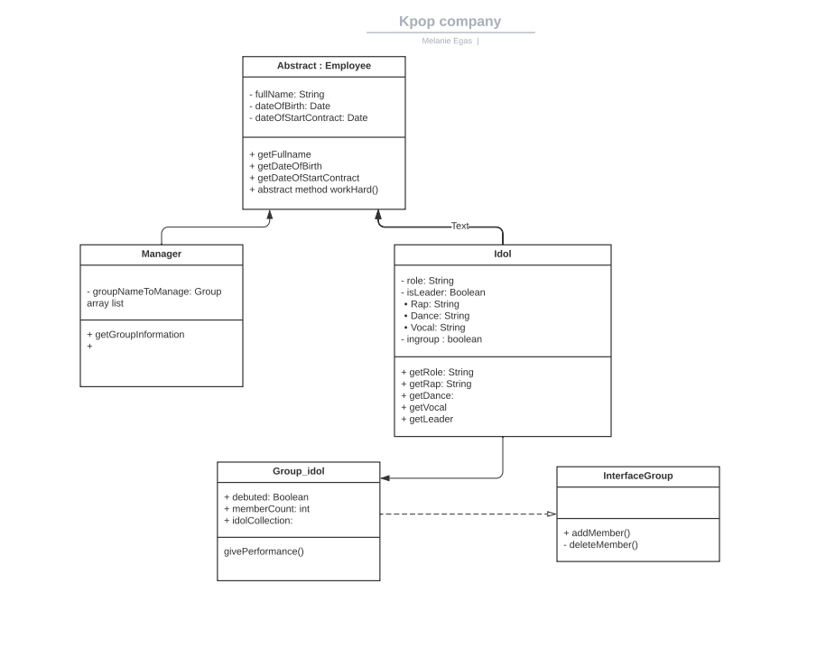
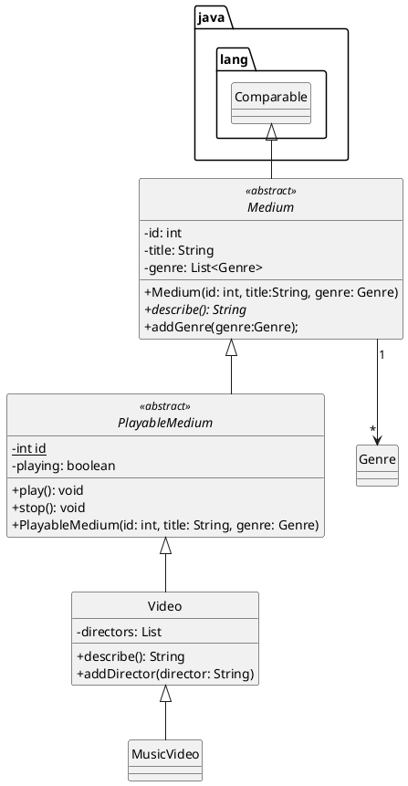

# Kpop programma

Voornaam: Melanie 

Achternaam: Grimminck

Studentnummer: 500858352

### Inleiding

Beschrijf hier kort het domein  en het doel van je applicatie.

### UML class diagram

https://lucid.app/lucidchart/b142287e-0925-4bf2-950e-3de9cdde1ec4/edit?invitationId=inv_0a48722b-0712-46d5-951e-0b8f39fc3772
```markdown
  
```




### Voorwaarden programma

#### OOP1

##### 1. Het commando `git log --pretty=format:"%hx %ad%x09%s" --date=short` bevat inzichtelijke atomaire commits op.

```
Plaats hier het resultaat van git log --pretty=format:"%hx %ad%x09%s" --date=short`
```

Bewijs:  [https://gitlab.fdmci.hva.nl/oop-dt/2122/id1s1/melanie-egas-tentamen]

##### 2. Abstract class 'A' correct geïmplementeerd

```java

public abstract class Employee {
    private String name;
    private int dateOfBirth;
    private int dateStartOfContract;

    public Employee() {
        name = " ";
        dateOfBirth = 2008;
        dateStartOfContract = 0;
    }

    public Employee(String name,
                    int dateOfBirth,
                    int dateStartOfContract) {
        this.name = name;
        this.dateOfBirth = dateOfBirth;
        this.dateStartOfContract = dateStartOfContract;
    }

    public String toString(){
        return "Name:\t"+ getName()+"\n"+ "Date of birth:\t"+ getDateOfBirth()+"\n" +"Start contract at:\t"+ getDateStartOfContract();
    }

    public String getName() {

        return name;
    }

    public int getDateOfBirth() {
        return dateOfBirth;
    }


    public int getDateStartOfContract() {
        return dateStartOfContract;
    }


    public abstract String workHard();
}

```

Bewijs:  [linknaarhetbronbestandinjerepo](https://gitlab.fdmci.hva.nl/repo-van-jou)

##### 3. Subclass implementeert abstract class
##### subclass 1 Manager:
```

public class Manager extends Employee implements  Comparable<Manager> {
    private int numberGroup;

    public Manager() {
        super();
        numberGroup = 0;
    }


    public Manager(int numberGroup) {
        super();
        this.numberGroup = numberGroup;
    }

    public Manager(String name,
                   int dateOfBirth,
                   int dateStartOfContract) {
        super(name,
                dateOfBirth,
                dateStartOfContract);
        numberGroup = 0;
    }

    public Manager(String name,
                   int dateStartOfContract,
                   int dateOfBirth, int numberGroup) {
        super(name,
                dateOfBirth,
                dateStartOfContract);
        this.numberGroup = numberGroup;
    }


    public String workHard() {
        return "Helping the idol!";
    }

    public String teachNewSong() {
        return "Teaching new song";
    }

    public String teachDancemove() {
        return "teaching dance move";
    }

    public int getNumberGroup() {
        return numberGroup;
    }

    public String toString() {
        return super.toString()+"\n" +"Number of groups:\t"+ getNumberGroup();
    }

    public boolean compare(Employee emp) {
        if (emp instanceof Manager) {
            Manager man = (Manager) emp; //castof
            if (man.numberGroup > numberGroup) {
                return true;
            }
        }
        return false;
    }
    @Override
    public int compareTo(Manager m){
        if(this.compare(m)){
            return 0;
        }
        return 1;
    }
}

```

#### subclass 2 idol:
''' package model;

public class Idol extends Employee {

    private boolean isLeader;
    private boolean inGroup;
    private String role;
    private boolean rap;
    private boolean dance;
    private String vocal;

    public Idol() {
        super();
        isLeader = false;
        inGroup = false;
        role = "None";
        dance = false;
        rap = false;
        vocal = "vocal";
    }

    public Idol(boolean isLeader,
                boolean inGroup,
                String role,
                boolean rap,
                String vocal,
                boolean dance) {
        super();
        this.isLeader = isLeader;
        this.inGroup = inGroup;
        this.role = role;
        this.rap = rap;
        this.vocal = vocal;
        this.dance = dance;
    }

    public Idol(String name,
                int dateOfBirth,
                int dateStartOfContract, boolean b, boolean b1, boolean b2, boolean b3, boolean b4) {
        super(name,
                dateOfBirth,
                dateStartOfContract);
        isLeader = false;
        inGroup = false;
        role = "None";
        dance = false;
        rap = false;
        vocal = "vocal";
    }


    public Idol(String name,
                int dateOfBirth,
                int dateStartOfContract,
                boolean isLeader,
                boolean inGroup,
                String role,
                boolean rap,
                String vocal,
                boolean dance
    ) {
        //zelfde als bij employee
        super(name,
                dateOfBirth,
                dateStartOfContract);
        this.isLeader = isLeader;
        this.inGroup = inGroup;
        this.role = role;
        this.rap = rap;
        this.vocal = vocal;
        this.dance = dance;
    }

    public boolean getLeader() {
        return isLeader;
    }

    public boolean getInGroup() {
        return inGroup;
    }

    public void setInGroup(boolean inGroup) {
        this.inGroup = inGroup;
    }

    public String Rap() {
        if (rap == true) {
            return "ho ho ho!";
        }
        return "sorry I don't rap!";
    }

    public String workHard() {

        return "Practicing very hard!";
    }

    public String sing() {

        return vocal + "!";
    }

    public String dance() {
        if (dance == true) {
            return "step step step";
        }
        return "Sorry not a dancer!";
    }

    public String getRole() {

        return role;
    }

    public boolean isRap() {

        return rap;
    }

    public boolean isDance() {

        return dance;
    }

    public String getVocal() {

        return vocal;
    }

    public String toString() {

        if (dance == true
                && rap == true
                && isLeader == true
                && inGroup == true) {
            return super.toString() + "\n" + "Position:\t" + getRole() + "\n" +
                    "Idol in group\n" +
                    "Leader of the group\n" +
                    "Rapper\n" +
                    "Dancer\n" +
                    vocal;
        } else {
            if (dance == true && inGroup == true) {
                return super.toString() + "\n" + "Position:\t" + getRole() + "\n"
                        + "Idol in group\n"
                        + " Dancer";
            }
            if (rap == true && inGroup == true) {
                return super.toString() + "\n" + "Position:\t" + getRole() + "\n"
                        + "Idol in group\n"
                        + "Rapper";
            }
        }
        return super.toString();
    }
}

'''

Bewijs:  [linknaarhetbronbestandinjerepo](https://gitlab.fdmci.hva.nl/repo-van-jou)

##### 4. Interface correct geïmplementeerd.

```java
Plaats hier je code snippets
```

Bewijs:  [linknaarhetbronbestandinjerepo](https://gitlab.fdmci.hva.nl/repo-van-jou)

##### 5. Er is een klasse aanwezig met minimaal twee constructors 

```java
Plaats hier je code snippets
```

Bewijs:  [linknaarhetbronbestandinjerepo](https://gitlab.fdmci.hva.nl/repo-van-jou)

##### 6. `super` key gebruikt voor aanroep constructor

```java
Plaats hier je code snippets
```

Bewijs:  [linknaarhetbronbestandinjerepo](https://gitlab.fdmci.hva.nl/repo-van-jou)

##### 7. `super` key gebruikt voor aanroep methode

```java
Plaats hier je code snippets
```

Bewijs:  [linknaarhetbronbestandinjerepo](https://gitlab.fdmci.hva.nl/repo-van-jou)

##### 8. `instanceof` aangetoond

```java
Plaats hier je code snippets
```

Bewijs:  [linknaarhetbronbestandinjerepo](https://gitlab.fdmci.hva.nl/repo-van-jou)

##### 9. cast gebruikt voor gebruik van classe-specifieke methodes

```java
Plaats hier je code snippets
```

Bewijs:  [linknaarhetbronbestandinjerepo](https://gitlab.fdmci.hva.nl/repo-van-jou)

##### 10. Er is testcode aanwezig om de punten hierboven te demonstreren. (Als je ook OOP2 doet: gebruik testcode-voorwaarden van OOP2)

```java
Plaats hier je code snippets
```

Bewijs:  [linknaarhetbronbestandinjerepo]

##### 11. Classes en methodes zijn voldoen aan HBO-ICT coding standards

```
Plaats hier je meest ingewikkelde stukje code met javadoc, en normaal commentaar  
```

Bewijs:  [linknaarhetbronbestandinjerepo](https://gitlab.fdmci.hva.nl/repo-van-jou)

#### OOP2

Naast de OOP1 voorwaarden dient je OOP2 programma aan de volgende voorwaarden te voldoen:

##### 1. Gebruikt en implementeert minimaal 2 functionele interfaces uit de package `java.util.function`
```java
Plaats hier je code snippets
```

Bewijs:  [linknaarhetbronbestandinjerepo](https://gitlab.fdmci.hva.nl/repo-van-jou)

##### 2. Een classe met 2 endpoints (d.m.v. Javalin framework)

   1. GET request waarbij er data uit een tekstbestand wordt gelezen en terug gestuurd.
   2. POST request waarbij er data wordt weggeschreven naar een tekstbestand.
```java
Plaats hier je code snippets voor GET request
```

Bewijs:  [linknaarhetbronbestandinjerepo](https://gitlab.fdmci.hva.nl/repo-van-jou)

```java
Plaats hier je code snippets voor POST request
```

Bewijs:  [linknaarhetbronbestandinjerepo]

##### 3. Een custom Exception "E" gedefiniëerd.

```
Plaats hier je code snippets
```

Bewijs:  [linknaarhetbronbestandinjerepo](https://gitlab.fdmci.hva.nl/repo-van-jou)

##### 4. Custom Exception "E" wordt gebruikt via een `throws` constructie.

```
Plaats hier je code snippets
```

Bewijs:  [linknaarhetbronbestandinjerepo](https://gitlab.fdmci.hva.nl/repo-van-jou)

##### 5. Custom Exception "E" wordt gebruikt via een `catch` constructie

```
Plaats hier je code snippets
```

Bewijs:  [linknaarhetbronbestandinjerepo](https://gitlab.fdmci.hva.nl/repo-van-jou)

##### 6. Minimaal 1 `intermediate operation` op een stream

```
Plaats hier je code snippets
```

Bewijs:  [linknaarhetbronbestandinjerepo](https://gitlab.fdmci.hva.nl/repo-van-jou)

##### 7. Minimaal 1 `terminal operation` op een stream

```
Plaats hier je code snippets
```

Bewijs:  [linknaarhetbronbestandinjerepo](https://gitlab.fdmci.hva.nl/repo-van-jou)

##### 8. Testcode met 100% code coverage

```
Plaats hier je code snippets
```

Bewijs:  [linknaarhetbronbestandinjerepo](https://gitlab.fdmci.hva.nl/repo-van-jou)

